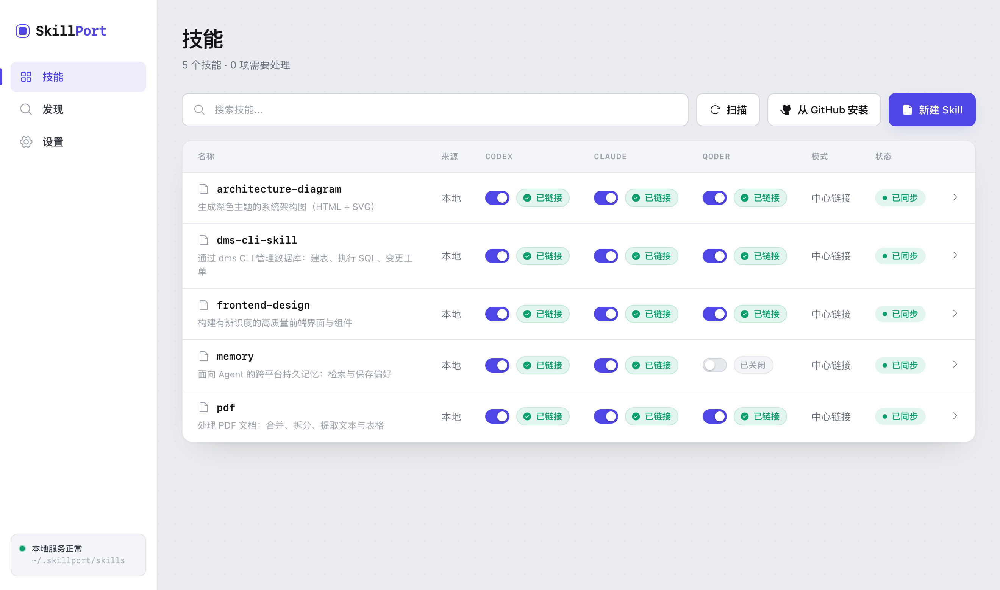

<div align="center">

# SkillPort

**一个本地中心目录，统一管理 Codex · Claude · Qoder 的所有 Skill。**

软链接同步 · 不上传云端 · 无需守护进程 · 配套中文管理页

[](https://github.com/zhangliyuangit/skillport/releases)


</div>

<p align="center">
  
</p>

---

## 为什么需要它

你的 AI Skill 散落在多个 Agent 目录里 —— `~/.codex/skills`、`~/.claude/skills`、`~/.qoder/skills`……
改一处要复制好几遍，版本还会悄悄漂移。

SkillPort 把它们收进**一个中心目录**，每个 Agent 用软链接指过去：**改一次，处处生效**。
全程本地：只监听 `127.0.0.1`、用一次性令牌保护接口，不上传任何 Skill。

## 能做什么

| 主题 | 能力 |
| --- | --- |
| **管理** | 扫描已有 Skill、纳入中心、查看状态与文本差异、按 Codex / Claude / 中心版本同步 |
| **多端** | 内置 Codex、Claude，并可注册任意自定义 Agent（如 qoder）；单独关闭/开启某一端；一键补齐 |
| **安全** | 危险操作前自动快照、可回滚；删除进回收站；`doctor` 健康检查与一键修复；安全脱钩卸载 |
| **创作 & 来源** | 从模板新建 Skill；从公开 GitHub 仓库安装、并可一键更新到最新 |
| **管理页** | 动态 Agent 列、SKILL.md 的 Markdown 预览（含语法高亮）、搜索、⌘K 命令面板、操作提示 |

## 快速开始

需要 Node.js 22 或更高版本。

```bash
npm install -g "https://github.com/zhangliyuangit/skillport/releases/download/v0.3.0/skillport-0.3.0.tgz"

skillport --version
skillport ui            # 打开本地中文管理页面
```

第一次使用：

```bash
skillport scan          # 发现 Codex / Claude 中已有的 Skill
skillport add pdf       # 纳入管理：两端软链接到中心副本，从此改一处处处生效
```

升级：重复执行上面的安装命令。卸载：`skillport uninstall`（安全脱钩）后 `npm uninstall -g skillport`。

## 命令速查

<details>
<summary>展开全部命令</summary>

```bash
# 发现与纳入
skillport scan
skillport add pdf                       # 两端不同会提示选择来源，不静默改文件
skillport add pdf --from codex
skillport new my-skill --description "一句话说明用途"

# 状态、差异、同步
skillport status [pdf]
skillport diff pdf
skillport sync pdf --from codex|claude|central

# 多端
skillport agent list
skillport agent add qoder --root ~/.qoder/skills
skillport agent populate qoder          # 把已有受管 Skill 补齐到新 Agent
skillport disable pdf --agent codex     # 单独关闭某一端（保留中心副本）
skillport enable  pdf --agent codex

# GitHub 来源
skillport install https://github.com/acme/skills [--path skills/pdf]
skillport update pdf                    # 从记录的来源重新拉取最新（自动先快照）
skillport update --all

# 安全与清理
skillport doctor [--fix]                # 扫描死链 / 漂移 / 孤儿，并可修复
skillport delete junk --agent codex     # 删除未纳管 Skill（移入回收站）
skillport snapshot create|list|restore
skillport remove pdf                    # 停止管理，保留各端可独立使用的副本
skillport remove --all                  # 全部脱钩为各端独立副本
skillport uninstall [--purge]
```

</details>

## 工作原理

纳入管理后，Skill 的真实内容只保存在中心目录，各端是指向它的软链接（不支持软链接时回退为复制）：

```text
~/.codex/skills/pdf   ─┐
~/.claude/skills/pdf  ─┼─►  ~/.skillport/skills/pdf   （唯一真相）
~/.qoder/skills/pdf   ─┘
```

```text
~/.skillport/
├── skills/       # 中心 Skill 副本
├── state.json    # 受管状态
├── config.json   # 已注册的 Agent 端（不存在时使用内置默认）
├── snapshots/    # 自动 / 手动快照
└── trash/        # 删除的 Skill（可手动恢复）
```

默认 Agent 目录：Codex `~/.codex/skills`、Claude Code `~/.claude/skills`。
用 `skillport agent add <id> --root <绝对路径>` 注册更多 Agent，也可以在管理页面的「设置」里添加。
可用环境变量 `SKILLPORT_HOME` 为测试或隔离环境指定另一个 SkillPort 目录。

## 安全约束

- 仅接受公开的 `https://github.com/<owner>/<repo>` 地址
- 校验 Skill 名称、仓库子路径、符号链接和 `SKILL.md`
- 所有写入先规划、再校验，并使用原子状态文件和回滚
- 管理页面只监听 `127.0.0.1` 的随机端口，并使用一次性随机令牌保护 API
- 冲突时不会猜测来源，也不会静默覆盖文件

## 从源码构建

```bash
git clone https://github.com/zhangliyuangit/skillport.git
cd skillport
npm install
npm run build
npm link -w packages/cli      # 或直接 node packages/cli/dist/main.js <command>
```

开发验证：

```bash
npm test
npm run typecheck
npm run build
```

设计验收记录见 [design-qa.md](design-qa.md)。
